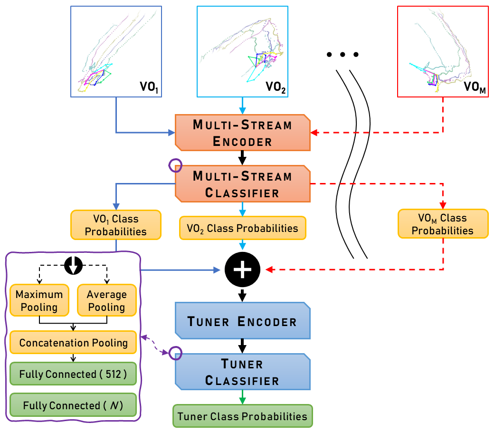

<p align="right">
 <!-- badges currently not working because the repository is private -->
&nbsp;
&nbsp;
&nbsp;
</p>

# e2eET Skeleton Based HGR Using Data-Level Fusion

This repository holds the PyTorch/FastAI implementation for **"Skeleton Based Hand Gesture Recognition Using Data Level Fusion"**.
Alternatively, this **[drive folder](https://drive.google.com/drive/folders/1BvoxkRDBK86A3_oNdQrnC8TLvp4l0W9x)** mirrors this repository but also contains the preprocessed .pckl files and generated .rar spatiotemporal datasets that are otherwise too large to be uploaded here.

The proposed hand gesture recognition (HGR) framework transforms the dynamic hand gesture recognition task into a static image classification task using data-level fusion and a custom ensemble tuner multi-stream CNN architecture.
For technical details, please refer to the following publication(s):

> **Development of a Lightweight Real-Time Application for Dynamic Hand Gesture Recognition** <br>
> *Oluwaleke Umar, Maki Habib* &mdash; [[IEEE ICMA Conference Paper](https://ieeexplore.ieee.org/document/10216066)]
>
> **Transforming Hand Gesture Recognition Into Image Classification Using Data Level Fusion** <br>
> *Oluwaleke Umar, Maki Habib, Mohamed Moustafa* &mdash; [[IGI Book Chapter](https://doi.org/10.4018/978-1-6684-7791-5.ch003)]
>
> **Real-Time Hand Gesture Recognition: Integrating Skeleton-Based Data Fusion and Multi-Stream CNN** <br>
> *Oluwaleke Umar, Maki Habib, Mohamed Moustafa* &mdash; [[ArXiv Preprint](https://arxiv.org/abs/2406.15003)]

A real-time HGR application developed based on our framework only requires video streams from any standard inbuilt PC webcam and operates with a minimal CPU and RAM footprint as shown in [`./images/application-memory-utilization.png`](./images/application-memory-utilization.png).
The application underscores the utility of our proposed framework for reducing the hardware requirements and computational complexity of the HGR task on a standard PC while achieving acceptable latency, frames-per-second, and classification accuracy.

<p align="center">
  
</p>


## Prerequisites

- Python == 3.8.5
- Vispy == 0.9.3
- PyTorch == 1.8.1+cu102
- FastAI == 2.5.3
- MediaPipe == 0.8.7.1
- Other dependencies described in requirements.txt


## Data-Level Fusion: Processing Benchmark Datasets

1. **Consiglio Nazionale delle Ricerche (CNR) Hand Gestures Dataset**
   - Download the [CNR dataset](https://github.com/aviogit/dynamic-hand-gesture-classification-datasets/tree/master/dynamic-hand-gestures-new-CNR-dataset-2k-images) and extract to the directory `./datasets/CNR/`.
   - Generate the spatiotemporal dataset by running the notebook `./modules/parse-data-CNRd.ipynb`. This will create randomized training and validation subsets from the original dataset. The spatiotemporal dataset will be saved to `./images_d/CNR-3d-original-1920px.1080px-[topdown]/`.

2. **Leap Motion Dynamic Hand Gesture (LMDHG) Database**
   - Download the [LMDHG dataset](https://www-intuidoc.irisa.fr/en/english-leap-motion-dynamic-hand-gesture-lmdhg-database/) and extract to the directory `./datasets/LMDHG/`.
   - Preprocess the dataset by running the notebook `./modules/parse-data-LMDHGd.ipynb`. This will create a file `./datasets/LMDHG_3d_dictPaperSplit_l750_s609.pckl`.
   - Generate the spatiotemporal dataset using `python modules/create_imgs_v5_LMDHGd_mVOs.py -c "modules/.configs/lmdhg-v5-default.hgr-config"`. The spatiotemporal dataset will be saved to `./images_d/LMDHG.mVOs-dictPaperSplit-3d.V1-noisy(raw).960px-[allVOs].adaptive-mean`.

3. **First-Person Hand Action (FPHA) Benchmark**
   - Download the [FPHA dataset](https://guiggh.github.io/publications/first-person-hands/) and extract to the directory `./datasets/FPHA/`.
   - Preprocess the dataset by running the notebook `./modules/parse-data-FPHAd.ipynb`. This will create a file `./datasets/FPHA_3d_dictPaperSplit_l250_s1175.pckl`.
   - Generate the spatiotemporal dataset using `python modules/create_imgs_v5_FPHAd_mVOs.py -c "modules/.configs/fpha-v5-default.hgr-config"`. The spatiotemporal dataset will be saved to `./images_d/FPHA.mVOs-dictPaperSplit-3d.V1-noisy(raw).960px-[allVOs].adaptive-mean`.

4. **3D Hand Gesture Recognition Using a Depth and Skeleton Dataset (SHREC2017)**
   - Download the [SHREC2017 dataset](http://www-rech.telecom-lille.fr/shrec2017-hand/) and extract to the directory `./datasets/SHREC2017/`.
   - Preprocess the dataset by running the notebook `./modules/parse-data-SHREC2017d.ipynb`. This will create a file `./datasets/SHREC2017_3d_dictTVS_l250_s2800.pckl`.
   - To generate the 14G and 28G spatiotemporal datasets:
      - Modify line 23 in `./modules/.configs/shrec2017-v5-default.hgr-config` such that `"n_dataset_classes": 14,` for 14G evaluation mode or `"n_dataset_classes": 28,` for 28G evaluation mode.
      - Execute `python modules/create_imgs_v5_SHREC2017d_mVOs.py -c "modules/.configs/shrec2017-v5-default.hgr-config"`.
   -  The 14G and 28G spatiotemporal datasets will be saved to `./images_d/SHREC2017.mVOs-3d.14g-noisy(raw).960px-[allVOs].adaptive-mean` and `./images_d/SHREC2017.mVOs-3d.28g-noisy(raw).960px-[allVOs].adaptive-mean` respectively.

5. **Dynamic Hand Gesture 14/28 (DHG1428) Dataset**
   - Download the [DHG1428 dataset](http://www-rech.telecom-lille.fr/DHGdataset/) and extract to the directory `./datasets/DHG1428/`.
   - Preprocess the dataset by running the notebook `./modules/parse-data-DHG1428d.ipynb`. This will create a file `./datasets/DHG1428_3d_dictTVS_l250_s2800.pckl`.
   - To generate the 14G and 28G spatiotemporal datasets:
      - Modify line 23 in `./modules/.configs/dhg1428-v5-default.hgr-config` such that `"n_dataset_classes": 14,` for 14G evaluation mode or `"n_dataset_classes": 28,` for 28G evaluation mode.
      - Execute `python modules/create_imgs_v5_DHG1428d_mVOs.py -c "modules/.configs/dhg1428-v5-default.hgr-config""`.
   -  The 14G and 28G spatiotemporal datasets will be saved to `./images_d/DHG1428.mVOs-3d.14g-noisy(raw).960px-[allVOs].adaptive-mean` and `./images_d/DHG1428.mVOs-3d.28g-noisy(raw).960px-[allVOs].adaptive-mean` respectively.

6. **SBU Kinect Interaction Dataset (SBUKID)**
   - Download the clean version of the [SBUKID dataset](https://vision.cs.stonybrook.edu/~kiwon/Datasets/SBU_Kinect_Interactions/README.txt) and extract the zipped files to the directory `./datasets/SBUKId/`.
   - Preprocess the dataset by running the notebook `./modules/parse-data-SBUKId.ipynb`. This will create a new folder `./datasets/SBUKId.txts/` and five files `./datasets/SBUKId_3D_dictCVS_f0{1,2,3,4,5}_s282.pckl`.
   - To generate the five cross-validation spatiotemporal datasets:
      - Modify lines 43 and 44 in `./modules/.configs/sbukid-v5-default.hgr-config` to specify the cross-validation fold i.e. `f01` and `F01` for the first cross-validation fold, `f02` and `F02` for the second cross-validation fold, and so on.
      - Execute `python modules/create_imgs_v5_SBUKId_mVOs.py"` five times with the above modification for the cross-validation fold..
   - There should be five cross-validation spatiotemporal datasets saved to `./images_d/SBUKId-3D-CVS.F0{1,2,3,4,5}.8G-norm.960px-[allVOs.adaptiveMean]`.
   - To verify that the cross-validation spatiotemporal datasets have been generated correctly, you can run `./modules/verify-images-SBUKId.ipynb`.

*NOTE: The parameters required to generate the spatiotemporal datasets are set in the `*.hgr-config` files. See `./modules/.configs/all-HGR-ds-schemas.json` for details about the parameters.*

> **Alternatively, the preprocessed .pckl files and generated spatiotemporal datasets can be downloaded from this [drive folder](https://drive.google.com/drive/folders/1BvoxkRDBK86A3_oNdQrnC8TLvp4l0W9x) and extracted to the corresponding `./datasets` and `./images_d` directories.**


## Model Training & Evaluation

The directory `./experiments.server` contains the training and evaluation code for all benchmark datasets. The directory `./runs.server` contains the relevant TensorBoard event logs and model graphs.
The arguments required for model training are set at the command line. See `./experiments.server/_trainingParameters` for details about the parameters.

*NOTE: Before training, ensure that the `datasetDirectories` object in `./experiments.server/_helperFunctions.py` points to the correct directories for the spatiotemporal datasets generated above and located at `./images_d` such that:*

```python
datasetDirectories = {
   "CNR16": "CNR-3d-original-1920px.1080px-[topdown]",
   "LMDHG13": "LMDHG.mVOs-dictPaperSplit-3d.V1-noisy(raw).960px-[allVOs].adaptive-mean",
      ...
      ...
      ...
   "SBUKID.F058": "SBUKId-3D-CVS.F05.8G-norm.960px-[allVOs.adaptiveMean]",
}
```

### Single-Stream (1SA) & Two-Stream (2SA) Experiments

`./experiments.server/sVO.mVO.Checkpoints.py` contains the code for testing the effect of different view orientations in the spatiotemporal datasets generated on classification accuracy of different datasets.

The notebook `./experiments.server/sVO.mVO.Checkpoints.ipynb` contains the necessary command line inputs while `./experiments.server/sVO.mVO.Checkpoints.yml` contains the results of extensive 1SA and 2SA experiments for all datasets.
The results of any experiments run will automatically be appended to that file. The TensorBoard event logs can be found in `./runs.server/sVO.mVO.Checkpoints.zip`.

**EX1 &ndash;**
1SA experiment on `DHG1428` with `14` classes using `top-down` view orientation running on GPU `0`:
```bash
python sVO.mVO.Checkpoints.py -IG 0 -nC 14 -mVOs top-down -dsN DHG1428
```

**EX2 &ndash;**
2SA experiment on `DHG1428` with `28` classes using `custom` and `side-left` view orientations (order-sensitive) running on GPU `1`:
```bash
python sVO.mVO.Checkpoints.py -IG 1 -nC 28 -mVOs custom side-left -dsN DHG1428
```

### Multi-Stream Ensemble Tuner Experiments

`./experiments.server/mVO.e2eEnsembleTuning.py` contains the code for training the spatiotemporal datasets using the custom Ensemble Tuner Multi-Stream CNN Architecture shown in the figure above.

The notebook `./experiments.server/mVO.e2eEnsembleTuning.ipynb` contains the necessary command line inputs while `./experiments.server/mVO.e2eEnsembleTuning.yml` contains the results of extensive 1SA, 2SA and 3SA experiments to find the optimal combination and ordering of mVOs for all datasets.
The results of any experiments run will automatically be appended to that file. The TensorBoard event logs can be found in `./runs.server/mVO.e2eEnsembleTuning.zip`.

**EX &ndash;**
3SA experiment on `DHG1428` with `14` classes using `top-down`, `custom` and `front-away` view orientation running on GPU `0`:
```bash
python mVO.e2eEnsembleTuning.py -IG 0 -nC 14 -mVOs top-down custom front-away -dsN DHG1428 -IISE 0 -ISIS 0
```

### Final Evaluation on Benchmark Datasets

The final evaluation for each benchmark dataset was carried out with the optimal combination and ordering of mVOs, along with training schedules.
The files `./experiments.server/allDatasets-e2eEnsembleTuning-Summary.xlsx` and `./experiments.server/allDatasets-e2eEnsembleTuning-Summary.yml` summarize how the final classification accuracies were obtained.

To reproduce the evaluation results reported in the paper, the notebook `./experiments.server/allDatasets-e2eEnsembleTuning-Evaluation.ipynb` contains the necessary command line inputs while `./experiments.server/allDatasets-e2eEnsembleTuning-Evaluation.yml` contains the evaluation results.
The TensorBoard event logs can be found in `./runs.server/allDatasets-e2eEnsembleTuning-Evaluation.zip`.

<!-- ˄˅↑↓ -->
| Benchmark Dataset | Classification Accuracy (%) |
| ----------------- | :-------------------------: |
| CNR               | 97.05 <sub>**↓1.73**</sub>  |
| LMDHG             | 98.97 <sub>**↑5.16**</sub>  |
| FPHA              | 91.83 <sub>**↓4.10**</sub>  |
| SHREC2017 (14G)   | 97.86 <sub>**↑0.24**</sub>  |
| SHREC2017 (28G)   | 95.36 <sub>**↓0.47**</sub>  |
| DHG1428 (14G)     | 95.83 <sub>**↓2.27**</sub>  |
| DHG1428 (28G)     | 92.38 <sub>**↓1.82**</sub>  |
| SBUKID            | 93.96 <sub>**↓4.34**</sub>  |
<!-- ˄˅↑↓ -->


## Live Real-Time HGR Application

<p align="center">
  
</p>

The real-time application recognizes the `Swipe- { Up | Down | Right | Left | + | V | X }` gestures from the DHG1428 dataset in both 14G/28G modes, i.e., the gestures can be performed using either one finger or the whole hand.

[`./images/dhg1428-swipe-gestures.png`](./images/dhg1428-swipe-gestures.png) shows the way the gestures are to be performed &ndash; same as in the original dataset. **[`./images/hgr_live_demo_video.mp4`](./images/hgr_live_demo_video.mp4) shows all the `Swipe` gestures being performed and recognized by the application in one take.**

> **The real-time application REQUIRES trained (.pkl) models which can be downloaded from this [drive folder](https://drive.google.com/drive/folders/1BvoxkRDBK86A3_oNdQrnC8TLvp4l0W9x) and extracted to the `./real-time-HGR-application/.sources` directory.**

<!-- *NOTE: The model required is OS-specific. Download either `[bf75]-7G-[cm_td_fa]-Windows.pkl` or `[bf75]-7G-[cm_td_fa]-Linux.pkl` from the drive folder and modify line 45 in `./real-time-HGR-application/gestureClassInference.py` as required.* -->
<!-- The code has been modified to automatically check for the OS! -->

To launch the real-time HGR application from the terminal, change your directory to `./real-time-HGR-application` and run `python liveStreamHGR.py`.
When all the required modules have been initialized (takes a little longer the first time), the terminal output should read:
```batch
(hlu) H:\path\to\e2eET-Skeleton-Based-HGR-Using-Data-Level-Fusion\real-time-HGR-application>python liveStreamHGR.py
INFO: Initialized <vispyOutputGUI.py> ...
INFO: Initialized <dataLevelFusion.py> ...
INFO: Initialized <liveStreamHGR.py> ...
INFO: Created TensorFlow Lite XNNPACK delegate for CPU.
INFO: dls.vocab=[0.Swipe+ 1.SwipeDown 2.SwipeLeft 3.SwipeRight 4.SwipeUp 5.SwipeV 6.SwipeX]
INFO: Initialized <gestureClassInference.py> ...
```

<br>

When all the application modules (with three windows as shown in [`./images/initialized-application-windows.png`](./images/initialized-application-windows.png)) have been initialized:

1. raise your hand in view of the camera and wait till a skeleton is overlaid on your hand <br> *(the skeleton overlay shows that the gesture sequence is being recorded)*
2. perform any of the `Swipe` gestures while maintaining the skeleton overlay <br> *(as shown in [`./images/dhg1428-swipe-gestures.png`](./images/dhg1428-swipe-gestures.png))*
3. press the `spacebar` to manually signal end-of-gesture <br> *(this initiates the data-level fusion and gesture class inference)*
4. you can keep performing gestures or press the `escape` key to terminate the application <br> *(you can also press the `c` key to manually clear any gesture sequences recorded)*
5. the gesture inferences are displayed in the output GUI and command line <br> *(inferences from the current session are also saved to `./real-time-HGR-application/hgr_output_log.yml`)* <br> *(inferences from previous sessions are appended to `./real-time-HGR-application/hgr_output_log.bak` at the start of a new session)*

<p align="center">
  
</p>

<hr>


## Citation

If you find this work contained in this repository useful in your research, please cite the following publication(s) as relevant:

```bibtex
@INPROCEEDINGS{10216066,
  author={Yusuf, Oluwaleke and Habib, Maki},
  booktitle={2023 IEEE International Conference on Mechatronics and Automation (ICMA)},
  title={Development of a Lightweight Real-Time Application for Dynamic Hand Gesture Recognition},
  year={2023},
  pages={543-548},
  doi={10.1109/ICMA57826.2023.10216066}}

```

```bibtex
@incollection{
   author = {Yusuf, Oluwaleke Umar and Habib, Maki K. and Moustafa, Mohamed N.},
   title = {Transforming Hand Gesture Recognition Into Image Classification Using Data Level Fusion: Methods, Framework, and Results},
   booktitle = {Global Perspectives on Robotics and Autonomous Systems: Development and Applications},
   editor = {Habib, Maki K.},
   pages = {39--78},
   publisher = {IGI Global},
   year = {2023},
   doi = {10.4018/978-1-6684-7791-5.ch003},
}
```

## Contact

For any questions, feel free to contact: `oluwaleke(dot)umar(at)aucegypt(dot)edu`

<hr>
